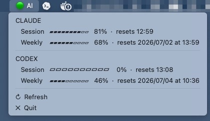

# ai_quota

macOS menu bar app that shows your **Claude Code** and **Codex CLI** quota at a glance — session and weekly, with reset times.



---

## Requirements

- macOS
- [Go](https://go.dev/dl/) 1.21+
- [`claude`](https://claude.ai/download) CLI installed and authenticated
- [`codex`](https://github.com/openai/codex) CLI installed and authenticated

---

## Install

```bash
git clone https://github.com/YOUR_USERNAME/ai_quota.git
cd ai_quota
go build -o ai_quota .
```

Move to a permanent location (optional):

```bash
mv ai_quota /usr/local/bin/ai_quota
```

Run:

```bash
ai_quota
```

The app appears in your menu bar as **AI** with a 🟢 or 🔴 status dot.

---

## Usage

Click the menu bar icon to see:

```
CLAUDE
   Session   ▰▰▰▰▰▰▱▱▱▱   62%  ·  resets 18:45
   Weekly    ▰▰▰▰▱▱▱▱▱▱   40%  ·  resets 2026/07/01 at 00:00

CODEX
   Session   ▰▰▰▰▰▰▰▰▱▱   80%  ·  resets 14:30
   Weekly    ▰▰▰▰▰▰▱▱▱▱   60%  ·  resets 2026/07/01 at 00:00

↻  Refresh
✕  Quit
```

Percentages show **remaining** quota. Click **↻ Refresh** to fetch latest values.

---

## Run on login (optional)

Create a launchd plist at `~/Library/LaunchAgents/com.local.ai_quota.plist`:

```xml
<?xml version="1.0" encoding="UTF-8"?>
<!DOCTYPE plist PUBLIC "-//Apple//DTD PLIST 1.0//EN"
  "http://www.apple.com/DTDs/PropertyList-1.0.dtd">
<plist version="1.0">
<dict>
  <key>Label</key>
  <string>com.local.ai_quota</string>
  <key>ProgramArguments</key>
  <array>
    <string>/usr/local/bin/ai_quota</string>
  </array>
  <key>RunAtLoad</key>
  <true/>
  <key>KeepAlive</key>
  <false/>
</dict>
</plist>
```

Load it:

```bash
launchctl load ~/Library/LaunchAgents/com.local.ai_quota.plist
```

---

## License

MIT

