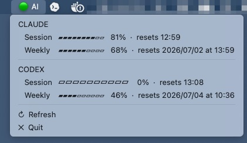

# ai_quota

A macOS menu bar app for **Claude Code**, **Codex CLI**, **DeepSeek**, and **OpenCode**. It shows live quotas plus a local token and cost report by model.



---

## Requirements

- macOS
- [Go](https://go.dev/dl/) 1.25+
- [`claude`](https://claude.ai/download) CLI installed and authenticated
- [`codex`](https://github.com/openai/codex) CLI installed and authenticated
- A DeepSeek API key configured for OpenCode through `DEEPSEEK_API_KEY` or `/connect`

---

## Code structure

- `main.go`: menu bar lifecycle and menu events.
- `quota/`: Claude, Codex, and DeepSeek quota retrieval plus tray formatting.
- `reports/`: usage collection, SQLite cache, aggregation, and HTML report rendering.

---

## Install

```bash
git clone git@github.com:htlcode/ai_quota.git
cd ai_quota
go build -o ai_quota .
```

Move to a permanent location (optional):

```bash
mv ai_quota /usr/local/bin/ai_quota
```

Run:

```bash
ai_quota
```

The app appears in your menu bar as **AI** with a 🟢 or 🔴 status dot.

---

## Usage

Click the menu bar icon to see:

Percentages show **remaining** quota. DeepSeek shows the current API balance for each currency.
Click **↻ Refresh** to fetch latest values.

Choose **Usage Reports…** to generate and open a current usage report in the default browser. The seven-day token chart groups Claude, OpenAI, DeepSeek, and Other by day, with each bar stacked by model. Empty AI groups are omitted. Daily cost totals appear below each AI bar. The current and previous month tables include token and cost totals for every AI group and model.

OpenCode costs are read directly from its local database. Claude and Codex costs are API-equivalent estimates when their logs do not report a cost.

Usage is loaded only when the report is opened. The app stores only daily numeric aggregates for the current and previous month in `~/Library/Application Support/ai_quota/usage.sqlite`; it never stores prompts or responses. Older aggregates are purged automatically. Each click writes the current snapshot into one temporary HTML file and opens it with the default browser.

---

## Run on login (optional)

Create a launchd plist at `~/Library/LaunchAgents/com.local.ai_quota.plist`:

```xml
<?xml version="1.0" encoding="UTF-8"?>
<!DOCTYPE plist PUBLIC "-//Apple//DTD PLIST 1.0//EN"
  "http://www.apple.com/DTDs/PropertyList-1.0.dtd">
<plist version="1.0">
<dict>
  <key>Label</key>
  <string>com.local.ai_quota</string>
  <key>ProgramArguments</key>
  <array>
    <string>/usr/local/bin/ai_quota</string>
  </array>
  <key>RunAtLoad</key>
  <true/>
  <key>KeepAlive</key>
  <false/>
</dict>
</plist>
```

Load it:

```bash
launchctl load ~/Library/LaunchAgents/com.local.ai_quota.plist
```

---

## License

MIT
